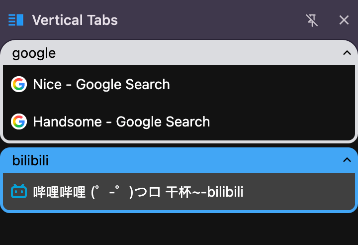
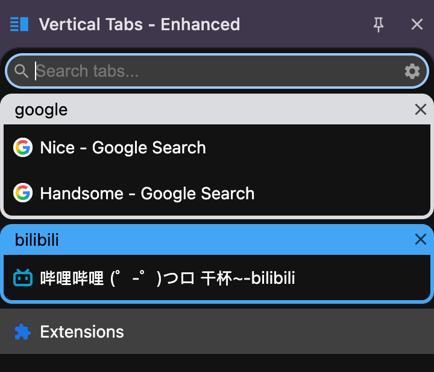

# Vertical Tabs - Enhanced Edition

A Chrome extension for managing tabs in a vertical sidebar with enhanced functionality and improved code readability.

## Screenshots

### Before & After

<table>
<tr>
<td></td>
<td></td>
</tr>
<tr>
<td align="center"><b>Before - Original Version</b></td>
<td align="center"><b>After - Enhanced Version</b></td>
</tr>
</table>

## 📖 About This Project

This project is based on the original [Vertical Tabs in Side Panel](https://chromewebstore.google.com/detail/vertical-tabs-in-side-pan/akahnknmcbmgodngfjcflnaljdbhnlfo) Chrome extension created by [Guo Kai](https://guokai.dev/). The original extension provides a clean and efficient way to manage browser tabs in a vertical layout.

### What We've Done

1. **Made Minified Code Readable**
   - Converted compressed/minified code into human-readable format
   - Added comprehensive documentation for all functions and classes

2. **Enhanced Features**
   - See [Enhanced Features](#-enhanced-features) section below

## ✨ Enhanced Features

This enhanced version includes the following improvements over the original:

### 1. **Group Close Button**

- Replaced the collapse icon with a close button on tab groups
- **Click the close button** → Close all tabs in the group
- **Click elsewhere on the group header** → Collapse/expand the group
- Close button styling matches the original collapse icon design
- Smart interaction that doesn't interfere with collapse functionality

### 2. **Top Search Bar (Default)**

- Search bar is now positioned at the top by default (instead of bottom)
- More intuitive placement for quick tab searching
- Can still be configured to bottom position in settings

### 3. **Auto-Focus Search**

- Search input automatically receives focus when the sidebar is activated
- Works with keyboard shortcuts for quick tab searching
- Focus is triggered on:
  - Initial sidebar load
  - Window focus (keyboard shortcut activation)
  - Any click within the panel
- Smart focus that doesn't interfere with other inputs or dialogs

## 🚀 Features (Original + Enhanced)

- **Vertical Tab Layout**: Manage tabs in a sidebar for better screen space utilization
- **Tab Groups**: Organize tabs into collapsible colored groups
- **Drag & Drop**: Easily reorder tabs and groups
- **Fuzzy Search**: Quickly find tabs with intelligent search
- **Context Menus**: Right-click actions for tabs and groups
- **Dark Mode**: Automatic theme switching based on system preferences
- **Customizable Settings**:
  - Search bar position (top/bottom)
  - Font size
  - New tab button
  - Close on double-click
  - Theme selection

## 🛠️ Installation

### For Users (Recommended)

1. Go to [Releases](https://github.com/YOUR_USERNAME/YOUR_REPO/releases)
2. Download the latest `vertitab-enhanced-vX.X.X.zip` file
3. Extract the zip file
4. Open Chrome and navigate to `chrome://extensions/`
5. Enable "Developer mode" in the top right
6. Click "Load unpacked"
7. Select the extracted `vertitab-enhanced` folder

### From Source (For Developers)

1. Clone or download this repository
2. Open Chrome and navigate to `chrome://extensions/`
3. Enable "Developer mode" in the top right
4. Click "Load unpacked"
5. Select the extension directory

## 📁 Project Structure

```
vertitab/
├── manifest.json          # Extension manifest
├── sidepanel.html         # Main sidebar interface
├── guide.html             # Welcome/guide page
├── sw.js                  # Service worker
├── css/
│   ├── sidepanel.css      # Main styles
│   └── sidepanel.dark.css # Dark theme styles
├── js/
│   ├── sidepanel.js       # Main application logic (refactored)
│   ├── guide.js           # Guide page logic
│   └── fuse.esm.min.js    # Fuzzy search library
├── icon/                  # Extension icons
├── img/                   # UI assets
└── _locales/              # Internationalization files
    ├── en/
    ├── zh_CN/
    ├── zh_TW/
    ├── ja/
    ├── de/
    ├── fr/
    ├── es/
    ├── pt_BR/
    └── pt_PT/
```

## 🔧 Development

### Code Structure

The main application logic is organized into the following classes:

- **Tabs**: Tab rendering and event handling
- **Groups**: Tab group management
- **DnD**: Drag and drop functionality
- **ContextMenu**: Right-click menu handling
- **Search**: Fuzzy search with Fuse.js
- **Settings**: User preferences management
- **CloseConfirm**: Confirmation dialogs

## 📄 License

This enhanced version maintains the same license as the original extension.

## 🙏 Credits

- **Original Extension**: [Vertical Tabs in Side Panel](https://chromewebstore.google.com/detail/vertical-tabs-in-side-pan/akahnknmcbmgodngfjcflnaljdbhnlfo)
- **Original Author**: [Guo Kai](https://guokai.dev/) - Creator of multiple useful Chrome extensions
- **Enhanced By**: Code refactoring, documentation, and feature additions
- **Fuzzy Search**: [Fuse.js](https://fusejs.io/)

## 🤝 Contributing

Contributions are welcome! This project focuses on:

- Maintaining clean, readable code
- Adding useful features without compromising simplicity
- Improving user experience

### For Maintainers

See [RELEASE.md](RELEASE.md) for instructions on creating new releases.

Quick release:

```bash
./release.sh
```

---

**Note**: This is an enhanced and refactored version created for educational purposes and improved maintainability. The original extension by [Guo Kai](https://guokai.dev/) can be found on the [Chrome Web Store](https://chromewebstore.google.com/detail/vertical-tabs-in-side-pan/akahnknmcbmgodngfjcflnaljdbhnlfo).
